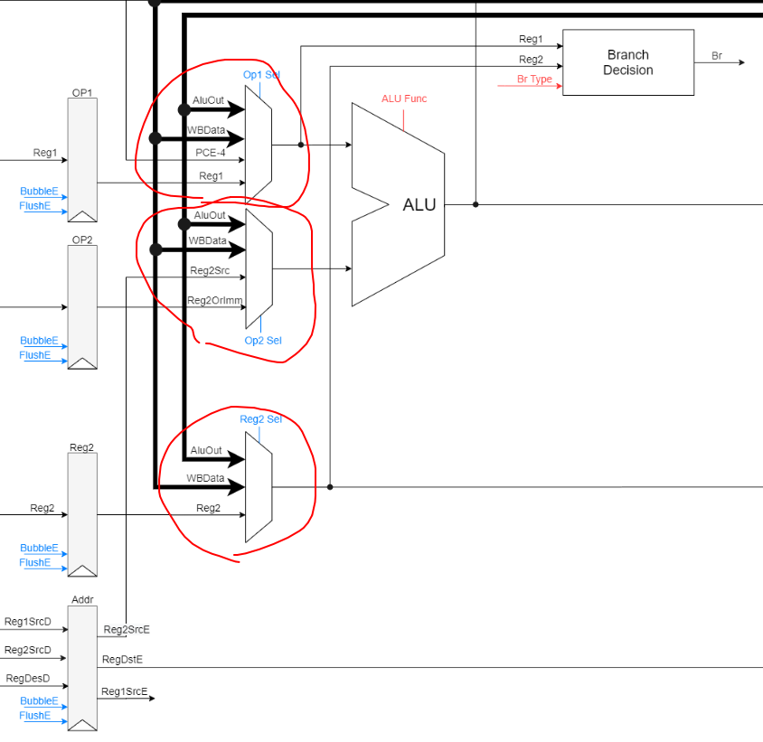
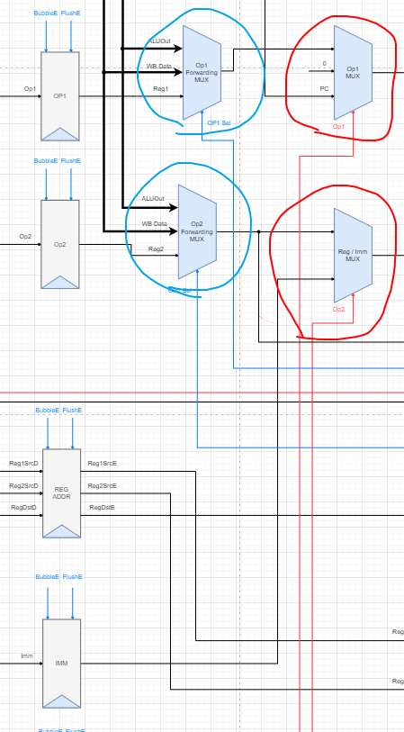

# 实验报告

-   PB17111568
-   郭雨轩

## 实验目的

实现一个支持 RV32I + CSR 的流水线CPU，并在行为级仿真中通过测试样例

## 实验环境

-   Windows 10

-   Vivado 2018.2

## 实验内容和过程

### 阶段一

根据 git 仓库中对阶段一的描述，我直接跳过了阶段一，直接对阶段二进行实现

### 修改数据通路

在给出的代码框架中，数据的转发与 ALU 操作数来源的原则混在了一起，使得 `Control Unit` 和 `Harzard Unit` 功能分的不是很清楚，如下图红圈中所示：



在我设计的CPU中，我对这些部分做了修改，如图：



其中，蓝色圈部分是由 `Harzard Unit` 负责，而红圈是由 `Control Unit` 负责，这样，原有的数据通路中从上往下数第三个红圈内的数据选择器可以省略。

### 控制信号生成

我在 `parameters.v` 中使用宏对每一条指令进行了编码，在控制单元模块中根据每一条指令，使用一个大的 always 语句进行统一描述，这样实现也更方便新加入指令。

### 冲突信号生成

冲突信号主要负责：转发信号的生成，在 Load-Use 型数据依赖、分支指令跳转成功这两种情况出现时需要 Flush 和 Stall 流水线。

转发信号生成时需要注意这种情况

``` assembly
add x1, x1, x1
add x1, x1, x1
add x1, x1, x1
...
```

在这种情况发生时，可以从 mem 和 wb 转发值，这时需要保证转发来的值是最新的（mem 段），这就需要当两个转发都有效的时候 mem 段有更高的优先级。还需要注意到转发的寄存器地址是否为 x0，若为 x0，则不转发。

在 Load-Use 信号生成的时候，只需要判断使用的寄存器号和用到的寄存器号是否相等。

在分支指令确实出现跳转的时候，就需要将这条指令以前的所有指令 flush 掉，避免产生影响（我实现的是默认分支不跳转的分支预测）

### 实现 CSR 的支持

根据官方文档中对 CSR 指令的描述，它需要满足原子性。在我的实现中，根据已有的数据通路，我新添加了一部分 CSR 指令需要用到的数据通路。在 ID 阶段，我新增了用来生成 CSR 指令的立即数的组合逻辑模块，同时将 CSR 寄存器的地址放入 EX 段寄存器中。在 EX 段，新增 CSR Reg File 和几个额外的 MUX，用以将CSR指令所需的操作数正确的送入 ALU，在计算过后，同时将 ALU 的结果写回到 CSR 寄存器。 

## 实验总结

在本次实验中，遇到的问题有：

-   错误的将 BGE 实现为了 BG
-   在分支指令执行时，忘记 FLushEX 段寄存器

时间分配：

-   4h 想好如何修改数据通路，以及各种控制信号和冲突信号应该如何生成
-   8h 修改数据通路和代码，完成阶段2
-   2h 实现对 CSR 的支持
-   1h 完成实验报告

收获：

-   对流水线 CPU 有了更深刻的认识
-   对 RV32I 指令级体系结构有了更深刻的认识，也对数据通路中的每个部件的作用和控制信号有了更好的了解
-   Verilog Debug 能力提升

## 改进意见

-   建议给出一个设计上更友好的设计通路
-   框架代码的 Bug 最好可以避免