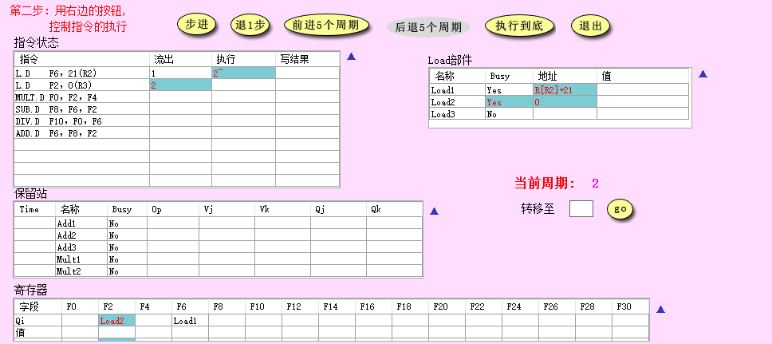
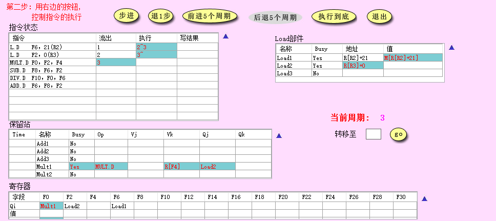
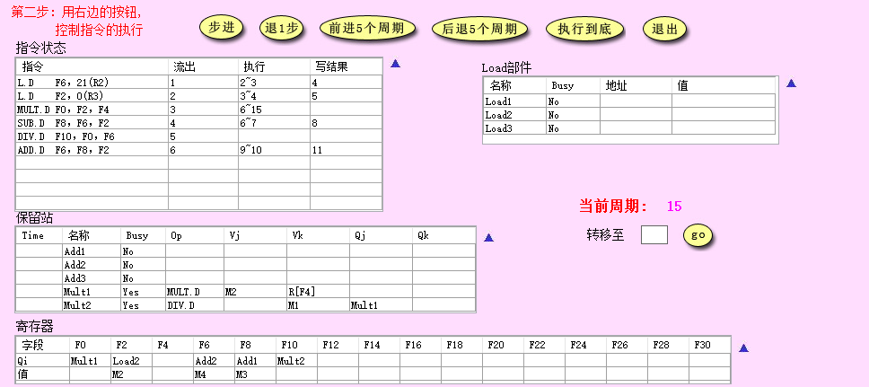
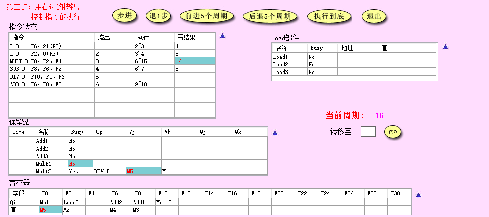
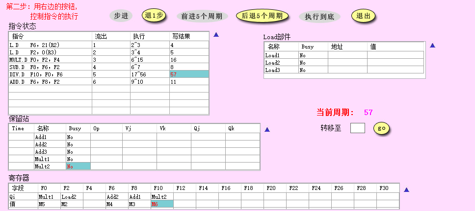
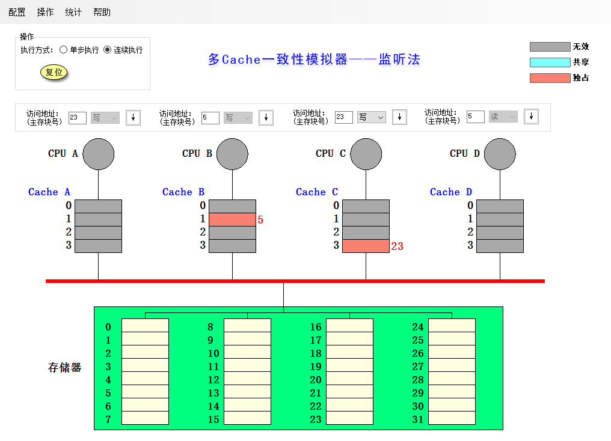
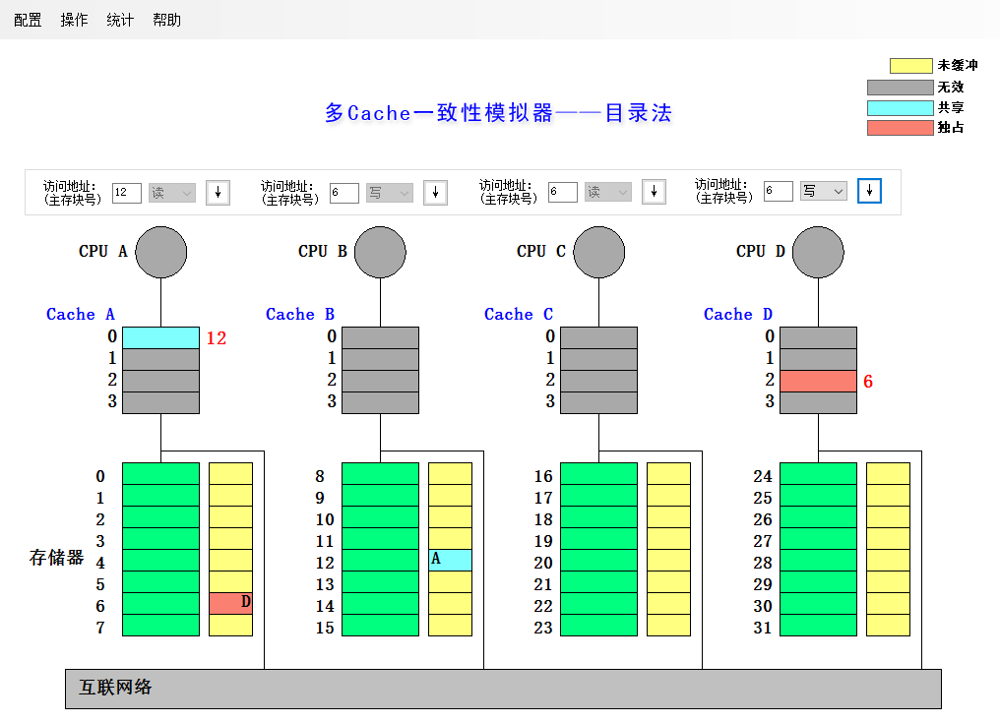

# 计算机体系结构-实验5

-   PB17111568
-   郭雨轩

## 实验1-Tomaslu

### 1

#### 周期2

#### 周期3

#### load 部件改动

-   更新了Load1的访存取值
-   更新了Load2的地址

### 2

#### 改动

-   指令`L.D F2, 0(R3)`写结束
-   指令`MULT.D F0, F2, F4  `开始执行
-   指令`SUB.D F8, F6, F2`开始执行
-   指令`ADD.D F6, F8, F2  `流出
-   保留站 Mult1 部件的 Time 变为 9
-   保留站 Add2 部件 Busy 变为 Yes，Op 为 ADD.D，Vk 为 M2 ， Qj 为 Add1  
-   寄存器Q6从 Load1 变成 Add2，busy变为yes
-   Load：无变化

### 3

指令2与指令3之间存在RAW相关

### 4

#### 周期15

#### 周期16

#### 变化

-   指令` MULT.D F0, F2, F4` 写结束  
-   保留站 Mult1 部件 Buzy变为 No  
-   Mult1 部件 Vj 变为 M5  
-   寄存器中 F0 写⼊ M5, busy 变为 no

### 5

在第57周期执行结束

## 实验2-监听法

| **所进行的访问** | **是否发生了替换？** | **是否发生了写回？** |              **监听协议进行的操作与块状态改变**              |
| :--------------: | :------------------: | :------------------: | :----------------------------------------------------------: |
|  CPU A 读第5块   |          否          |          否          |        存储器第5块放入CPU A cache第一块，并送往CPU A         |
|  CPU B 读第5块   |          否          |          否          |        存储器第5块放入CPU B cache第一块，并送往CPU B         |
|  CPU C 读第5块   |          否          |          否          |        存储器第5块放入CPU C cache第一块，并送往CPU C         |
|  CPU B 写第5块   |          否          |          否          | 写命中CPU B Cache第一块，设为独占，CPU A 与 CPU C cache 第一块作废 |
|  CPU D 读第5块   |          否          |          是          | CPU B Cache的第1块写回存储器第5块，设为共享， 之后把存储器第 5 块取⾄CPU D Cache 的第 1 块， 再送至⾄ CPU D |
|  CPU B 写第21块  |          是          |          否          | 写CPU B Cache第一块不命中，取存储器21块到CPU B Cache第一块，设为独占，CPU B写入Cache第一块 |
|  CPU A 写第23块  |          否          |          否          | 写CPU A Cache第3块不命中，取存储器23块到CPU A Cache第3块，设为独占，CPU A写入Cache第3块 |
|  CPU C 写第23块  |          否          |          否          | CPU A Cache第 3 块写回存储器第 23 块，存储器第 23 块取⾄CPU C Cache 第 3 块，设为独占，CPU C 写⼊ Cache的第 3 块 |
|  CPU B 读第29块  |          否          |          是          | CPU B Cahce第 1 块写回存储器第 21 块，存储器第 29 块取⾄CPU B Cache的第 1 块，设为共享，读⾄ CPU B |
|  CPU B 写第5块   |          否          |          是          | 取存储器第 5 块到CPU B Cache 第 1 块，设为独占，CPU D Cache 第 1 块作废， CPU B 写⼊ Cache第 1 块 |

## 实验3-目录法

| **所进行的访问** |              **监听协议进行的操作与块状态改变**              |
| :--------------: | :----------------------------------------------------------: |
|  CPU A 读第6块   | CPU A  Cache读第 2 块不命中，向宿主结点存储器第 6 块发送读不命中(A, 6)消息，宿主把数据块传给本地节点 Cache第2块，共享集合设为$\{A\}$，块被送到CPU A |
|  CPU B 读第6块   | CPU B  Cache读第 2 块不命中，向宿主结点存储器第 6 块发送读不命中(B, 6)消息，宿主把数据块传给本地节点 Cache第2块，共享集合设为$\{A,B\}$，块被送到CPU B |
|  CPU D 读第6块   | CPU D Cache读第 2 块不命中，向宿主结点存储器第 6 块发送读不命中(D, 6)消息，宿主把数据块传给本地节点 Cache第2块，共享集合设为$\{A,B,D\}$，块被送到CPU D |
|  CPU B 写第6块   | CPU B Cache写第2块命中，向宿主结点存储器第 6 块发送写命中(B, 6)消息， 宿主向远程结点 Cache A 第 2 块与 Cache D 第 2 块发送作废(6)消息，共享集合设为 $\{B\}$，CPU B 写⼊ Cache的第 2块 |
|  CPU C 读第6块   | CPU C Cache读第 2 块不命中，向宿主结点存储器第 6 块发送读不命中(C, 6)消息，宿主向远程结点 CPU B Cache第 2 块发送取数据块(6)的消息，远程结点把第6块数据送给宿主结点，宿主把数据块送给本地节点CPU C Cache第 2 块，共享集合设为$\{B,C\}$，块被送到CPU C |
|  CPU D 写第20块  | CPU D Cache写第0块不命中，向宿主结点存储器第 20 块发送写不命中(D, 20)消息，宿主把数据块送给CPU D Cache 第 0 块，共享集合设置为$\{D\}$，块被送到CPU D |
|  CPU A 写第20块  | CPU A Cache写第0块不命中，向宿主结点存储器第 20 块发送写不命中(A,20)消息， 宿主向远程结点 CPU D Cache第 0 块发送取并作废(20)消息，远程结点把数据块送给宿主结点把CPU D Cache第 0 块作废，宿主把数据块送给本地结点CPU A Cache第 0 块，共享集合设为$\{A\}$ ， CPU A 写Cache的第 0 块 |
|  CPU D 写第6块   | CPU D Cache写第 2 块不命中，向宿主结点存储器第 6 块发送写不命中(D,6)消息， 宿主向远程结点 CPU B Cache第 2 块与CPU C Cache第 2 块发送作废(6)消息，远程结点把数据块送给宿主结点并将 CPU D Cache第 0 块作废，宿主把数据块送给Cache第 2 块，共享集合设为$\{D\}$ ， CPU D 写⼊ Cache第 2 块 |
|  CPU A 读第12块  | CPU A Cache 第 0 块读不命中，向被替换块的宿主结点存储器第 20 块发送写回并修改共享集(A, 20)消息，再向宿主结点存储器第 12 块发送读不命中(A, 12)消息，宿主把数据块送给CPU A Cache 第 0 块，共享集合设为$\{A\}$，送入CPU A |

## 综合问答

### 1

-   监听法在核数较少时，总线压力较小，成本低，效果好，但是当核数增多时，总线冲突增加。
-   目录法使用集中目录来记录cache的状态，总线压力小，但是随着核数增加时目录的开销变大

### 2

-   两者都解决了三种相关，两种算法都是通过动态调度的方式来解决RAW冲突，在解决WAR和WAW时，Tomasulo使用Renaming的技术，Score Board使用插入Stall的技术
-   Tomasulo是分布式，Score Board是集中式

### 3

-   RAW：Tomasulo跟踪每个源操作数，仅当所有源操作数可用时才发射指令
-   WAR，WAW：Tomasulo使用硬件寄存器重命名技术解决WAR和WAW